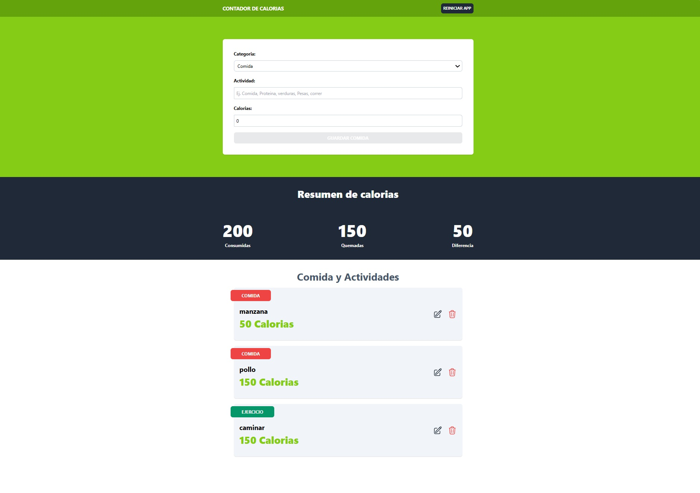

# Contador de Calorias

Aplicacion que se encarga de trackear las calorias, tanto su consumo como la quema,
utlizando un form para el agregado como la edicion de las mismas

## Características

- Se utiliza `useContext` para un estado global.
- Para las acciones y modificación de los distintos states, se utiliza `useReducer`.
- El proyecto está desarrollado con `TypeScript` y `React`.

## Vista previa del proyecto

